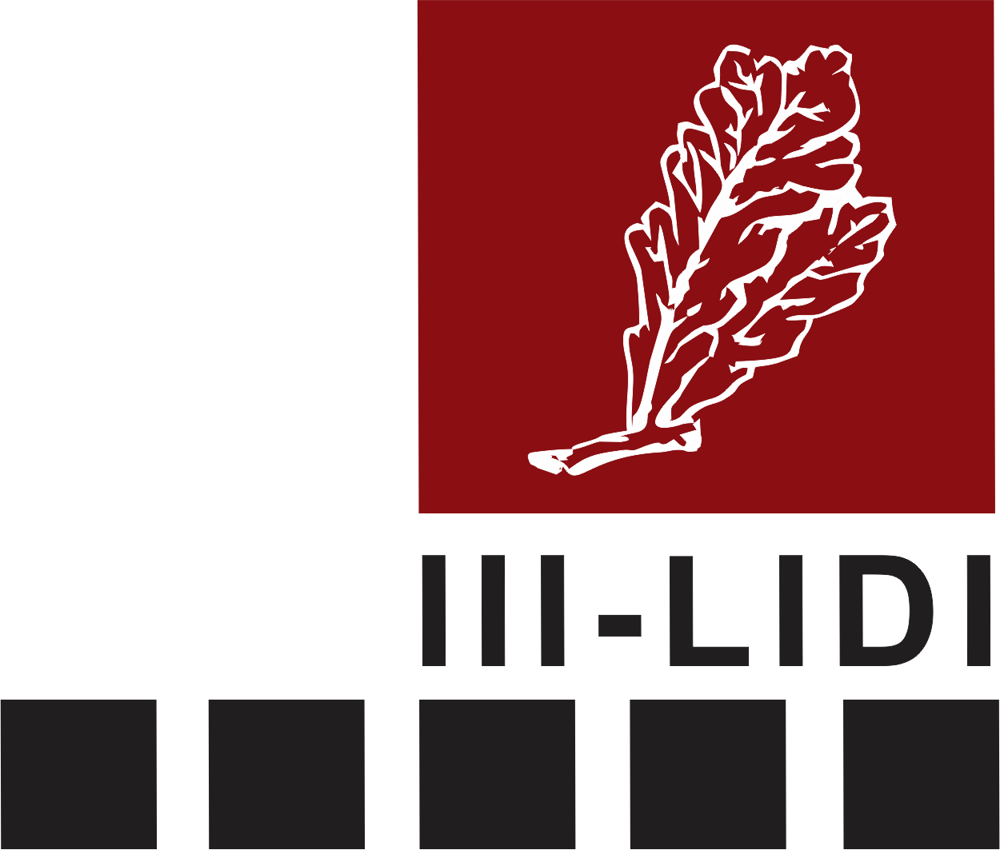

<p align="center">
  
  <h1 align="center">PlateUNLP</h1>
</p>

<p align="center">
  Process and calibrate spectroscopic observations.
</p>


<p align="center">
  <a title="Instituto de Investigación en Informática LIDI (III-LIDI)" target="_blank" href="https://weblidi.info.unlp.edu.ar/"></a>
  <a title="Facultad de Ciencias Astronómicas y Geofísicas (FCAGLP)" target="_blank" href="https://www.fcaglp.unlp.edu.ar/"></a>
  <a title="Recuperación del Trabajo Observacional Histórico (ReTrOH)" target="_blank" href="https://retroh.fcaglp.unlp.edu.ar/"></a>
  <a title="Instituto de Astrofisica de La Plata (CONICET-UNLP)" target="_blank" href="https://ialp.fcaglp.unlp.edu.ar/"></a>
</p>

---

## Development

To develop this project locally, you'll need [Node.js v22](https://nodejs.org/) and [pnpm v10](https://pnpm.io/). After you have cloned the repository, run the following commands to set up your environment:

```bash
pnpm install  # To install dependencies
pnpm db:init  # To initialize and seed the database
pnpm dev      # To start the development server
```

## Deployment

As is, PlateUNLP can be deployed using any platform that supports Node.js applications. Right now, we are using [Railpack](https://railpack.com/) to deploy the application.

Before starting the application in a production environment, make sure to set the following environment variables:
- `DATABASE_URL`: The database connection URL.
- `DATABASE_TOKEN`: The authentication token for the database (if required).
- `UPLOADS_DIR`: The directory path where uploaded files will be stored.
- `BETTER_AUTH_SECRET`: A secret key for authentication purposes.
- `BETTER_AUTH_URL`: The URL where the app is exposed.

There are two important scripts for deployment:
```bash
pnpm build    # To build the application for production
pnpm start    # To start the application in production mode
```

### Database

We're using [libSQL](https://github.com/tursodatabase/libsql) as our database solution, a fork of SQLite. This allows us to use a file-based database when developing locally, and a cloud-hosted database when deploying.

We recommend hosting a libSQL server for easy access from the outside for maintenance and backups. You can find more about this [here](docs/src/maintenance/libsql.md).

## Migrations

To manage database schema changes, we use Drizzle ORM's migration system. You can create and apply migrations using the following commands:
```bash
pnpm db:generate 'migration-name'  # To create a new migration
pnpm db:migrate                    # To apply pending migrations
```
