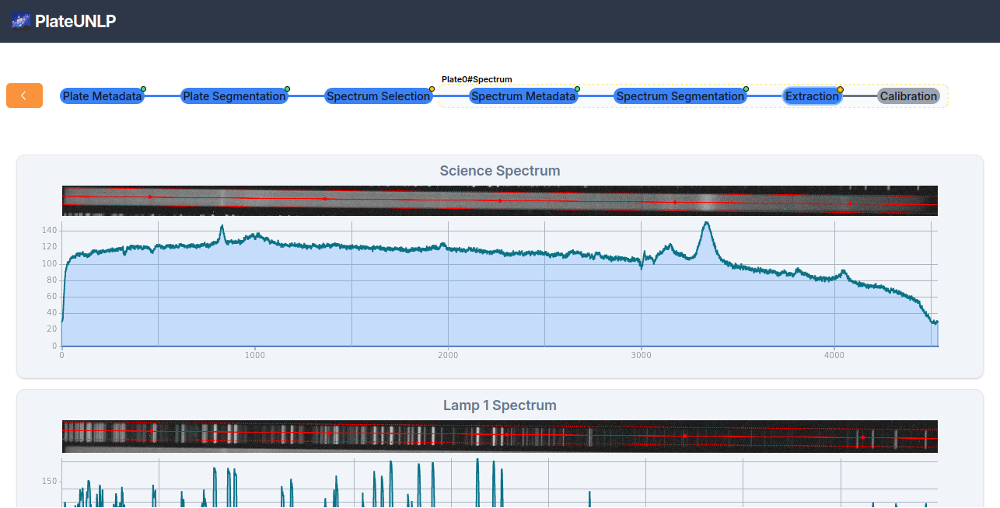
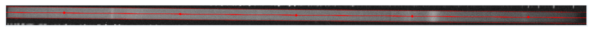
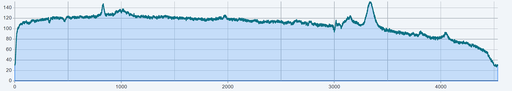
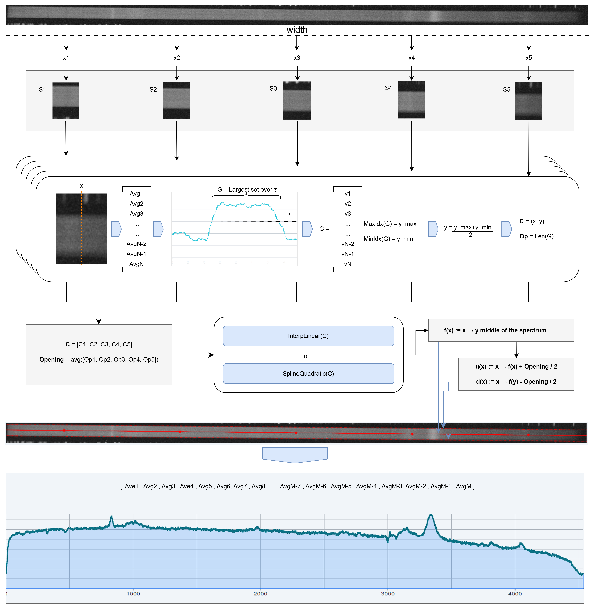
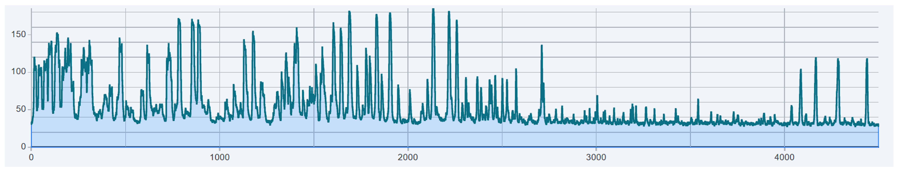

# Extracción de caracteristicas

Esta etapa consiste en la obtencion de los espectros 1D correspondientes a las imagenes del espectro de ciencia y los 2 espectros de lamparas obtenidos en [Segmentación de espectro](#segmentación-de-espectro).

Para lograr la extraccion de los espectros 1D lo primero es partir de la imagen $ImgSc$ del espectro de ciencia:

Se buscan $N$ valores equidistantes $x_i$ sobre el ancho ancho $W$ total de la imagen, por defecto $N=5$. Los $x_i$ se obtienen acorde a la formula:

$$
x_i = i \cdot \left( \frac{W}{N} \right) + \frac{1}{2} \cdot \left( \frac{W}{N} \right)
$$

Cada valor $x_i$ se lo ubica sobre el eje X de la matriz de la imagen y se copian en una nueva imagen las columnas que corresponden al intervalo de columnas $[x_i - S_{width}: x_i + S_{width}]$ respecto a la matriz de la imagen original. $S_{width}$ es el ancho en pixeles de los segmentos a recortar, por defecto $S_{width}=60$. La subimagen correspondiente a cada $x_i$ la definimos como $S_i$

$$
S_i = ImgSc[...][ x_i - S_{width} : x_i + S_{width}]
$$

Dada cada subimagen $S_i$, la cual corresponde a una matriz de pixeles de 2 dimensiones vamos a mapear sus valores a un arreglo donde cada posicion se corresponde con una fila del segmento y los valores de todos los pixeles de una misma fila son promediados. Llamamos al arreglo resultante arreglo de promedios horizontales $S_iAvgH$,

$$

S_iAvgH = [AvgH_{1}, AvgH_{2}, ..., AvgH_{S_{height}}]
$$

Dada una fila $row$ el valor se su promedio horizontal se calcula como:

$$
S_iAvgH[row] = \frac{1}{S_{i(width)}} \cdot ∑_{col=0}^{S_{i(width)}-1} S_i[row][col]
$$

Teniendo los vectores $S_iAvgH$ se hace un filtrado de todos aquellos valores que queden por debajo de un umbral $τ$, por defecto $τ=0.6$. Entonces definimos a los arreglos $F_i$ como:

$$
F_i= \{ x \in S_iAvgH \mid x \geq κ \}
$$

$$
κ = \min(S_iAvgH) + (\max(S_iAvgH) - \min(S_iAvgH)) \cdot \tau
$$

Luego de obtener el arreglo filtrado $𝐹_𝑖$, identificamos segmentos contiguos de valores que estaban ubicados en posiciones consecutivas en el arreglo original $𝑆_iAvgH$. Es decir, si dos valores filtrados en $𝐹_i$ provienen de posiciones $𝑗$ y $𝑗+1$ en $𝑆_iAvgH$, se consideran parte del mismo grupo.

A partir de esta agrupación, se forman subconjuntos $𝐺_{i,1}, 𝐺_{i,2}, ..., 𝐺_{i,k} tales que cada grupo contiene valores contiguos (según su posición original). Finalmente, se elige el grupo más largo:
$$
G_i = \arg\max_{G_{i,j}} \, |G_{i,j}|
$$

Los valores contenidos en $G_i$ se corresponden con el rango de píxeles verticales donde se estima que se encuentra el espectro. Dado el índice superior $y_{i, up}$ el inferior $y_{i, down}$, se calcula el píxel central del espectro en el segmento $S_i$ como:

$$
y_i = \mathrm{round}(\frac{y_{i, up} + y_{i, down}}{2})
$$

Ahora que conocemos que a cada píxel horizontal $x_i$ le corresponde una fila $y_i$. que representa el centro del espectro, se puede definir una serie de $N$ puntos que trazan el centro del espectro de ciencia como:

$$
c_{i} = (x_i, y_i)
$$

$$
C = \{(x_i, y_i)\}_{i=0}^{N-1}
$$

Tambien aprovechando los grupos $G_i$ calculados antes obtenemos el valor promedio de que tan ancho es el espectroentre todos los $S_i$:

$$
Opening = \frac{1}{N} \cdot ∑_{i=0}^{N-1} |G_i|
$$

Con los centros separados, lo que sigue es trazar la función que recorre el centro del espectro de ciencia. Se contemplaron dos métodos para construir dicha función:

$$
f(x) = Interp_{linear}(C)
$$

o

$$
f(x) = Spline_{quadratic}(C)
$$

PlateUNLP delega al usuario la elección del método de interpolación para realizar el trazado de la recta media a través de la imagen del espectro de ciencia. Para tener mas información respecto a cada opción consultar [Funciones de Interpolación](FuncionesDeInterpolación.md).

Una vez definida la función $f(x)$, que dado cualquier pixel horizontal $x$ indica la altura por la que pasa el centro del espectro, es posible obtener las funciones que delimitan el borde superior $u(x)$ e inferior $d(x)$ del espectro, utilizando el valor promedio de apertura $Opening$:

$$
u(x) := x → f(x) + Opening / 2
$$

$$
d(x) := x → f(x) - Opening / 2
$$

A continuacion se muestran las trazas de estas 3 funciones sobre la imagen del espectro. En medio $f(x)$ como una linea roja continua, arriba y abajo, $u(x)$ y $d(x)$ respectivamente como lineas rojas punteadas:

Para cada valor de $x$, utilizando las funciones $u(x)$ y $d(x)$, podemos determinar el intervalo vertical que contiene el espectro en la columna correspondiente de la imagen. Así, definimos un subconjunto de píxeles por columna:

$$
ArrCol_i = \{ Img[i,j] \}_{j=u(i)}^{d(i)}
$$

Luego, calculamos el valor promedio de intensidad en cada una de estas columnas para obtener el espectro de ciencia unidimensional, $ScienceSpectrum1D$:

$$
\begin{equation}
    M = |ArrCol_i|
\end{equation}
$$

\label{eq:pepdsd}
$$
\begin{equation}
\text{ScienceSpectrum1D} = \{ \frac{1}{M} \cdot ∑_{k=0}^{M} ArrCol_i[k] \}_{i=0}^{Img_{width}}
\end{equation}
$$

Finalmente, se grafica el espectro resultante, representando la intensidad promedio del espectro de ciencia para cada píxel horizontal de la imagen:

El siguiente gráfico proporciona una visión general de todo el procedimiento necesario para obtener el espectro de ciencia unidimensional (1D):

## Lamparas de comparación

