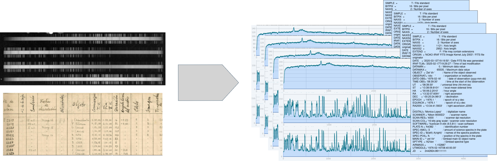

# Introducción

PlateUNLP es un software diseñado para procesar imágenes de espectros de luz (usualmente ruidosas), con el objetivo de extraer y limpiar la información relevante.

De cada placa se separa la información correspondiente a cada espectro que contiene, recopilando funciones representativas calibradas longitud, así como los metadatos más relevantes (Main-ID, UT, etc.).
