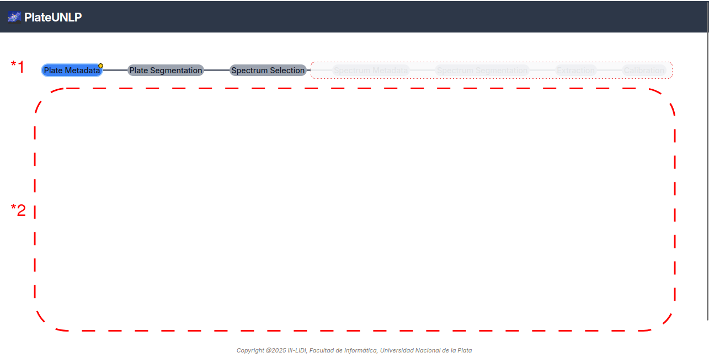
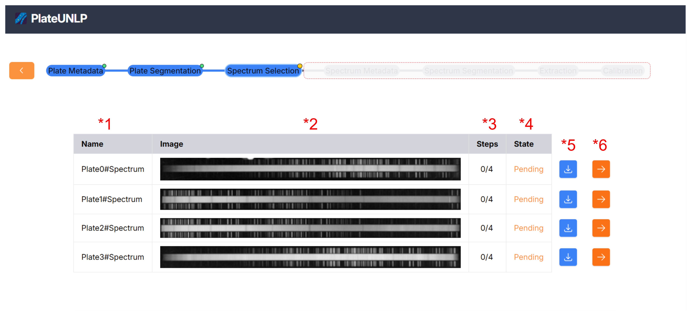
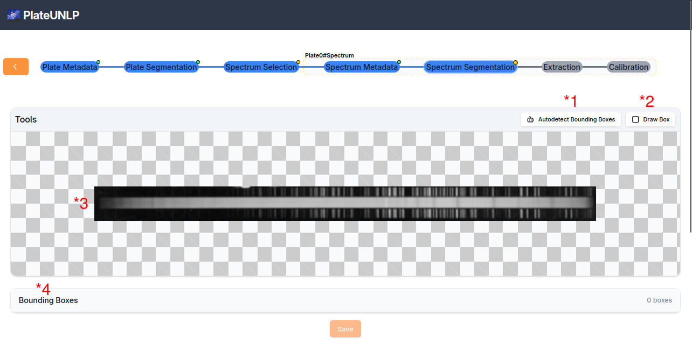
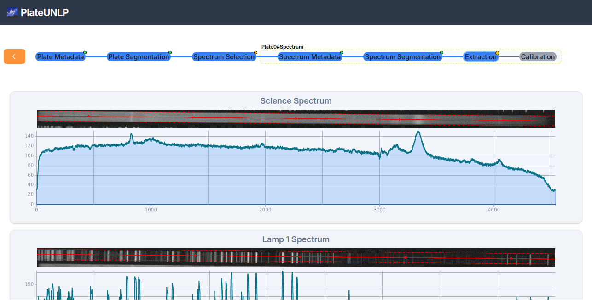
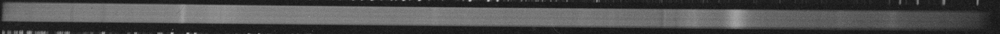
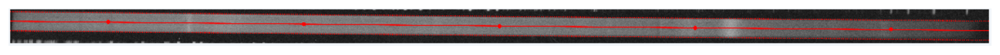

# Introducción

PlateUNLP es un software diseñado para procesar la informacion de imagenes de espectros de luz (usualmente ruidosas) para conseguir la información importante extraida y limpia.

De cada placa se separa la informacion relacionada a cada espectro que contiene, recopilando funciones de cada espectro, calibradas en la longitud de onda que les corresponda asi como los metadatos mas relevantes que le corresponden (Main-Id, UT, ...).

# Distribución de componentes

El software esta compuesto por 2 componentes principales:

1. Barra de navegación: muestra la etapa de procesamiento actual y permite la navegacion entre distintas etapas.
2. Seccion funcional: Aqui se localizan menus o interfaces necesarios para resolver cada. Naturalmente, el contenido varia de etapa a etapa.

# Metadatos de Placa

Lo primero que uno se encuentra al abrir el software es la seccion de metadatos de Placa:

En esta seccion se busca obtener los metadatos que son comunes a todos espectros que hay en una misma placa, sean estos:

| Metadato | Definición |
|:---------|:----------:|
| OBSERVAT (obligatorio) | Observatorio donde se capturo la placa |
| PLATE-N (obligatorio) | Identificador de placa |
| OBSERVER | Persona que realizo las observaciones |
| DIGITALI | Persona que digitalizo las observaciones |
| SCANNER | Especificación tecnica del escaner empleado |
| SOFTWARE | Software usado para digitalizar la placa |
| TELESCOPE | Telescopio con el que se capturaron los datos |
| DETECTOR | Instrumento que se capturo la imagen |
| INSTRUMENT | El instrumento que se utilizo (ej: espectrógrafo) |

Una ves especificados todos los metadatos (minimo los obligatorios) el usuario puede acceder a la siguiente etapa por medio del boton _Save_.

**NOTA**: Si faltan metadatos obligatorios se le señalara al usuario marcando los campos faltantes al cliquiear _Save_.

# Segmentación de placa (Identificación de espectros)

La etapa de Segmentacion de placa busca identificar las porciones del escaneo original que se corresponden a cada espectro a procesar.

Lo primero que hay que hacer es cargar el archivo de la placa escaneada:

Cargado el archivo se habilita la interfaz de segmentacion de espectros, compuesta por los siguientes elementos:

1. **Boton _Autodetect Bounding Boxes_**: al cliquearlo se ejecuta un modelo detector de espectros sobre la imagen. Sus predicciones se aprovechan para identificar las posiciones de cada espectro y señalarlas con cajas delimitadoras.

Para saber mas leer [Detector de Espectros](./DetectorDeEspectros.md)

2. **_Rotate 90º_**: al cliquear, la imagen es rotada la imagen 90º a la derecha. Solo visualización (no afecta como se almacenan los datos mas adelante)9.

3. **_Invert colors_**: invierte los colores de la imagen. Solo visualización.

4. **_Draw Box_**: al seleccionarlo se entra en modo de dibujo, que permite al usuario crear cajas delimitadoras sobre la imagen. Asi este puede indicar la posicion de espectros de forma manual.

5. **_Area de vizualización_**: se muestra el escaneo seleccionado en un menu interactivo que permite acercar/alejar/arrastrar la imagen. Tambien muestra las cajas delimitadoras especificadas y permite su redimension/arrastre. Para interactuar con una caja delimitadora hay que hacer click sobre ella y entrara en modo de edicion, para deseleccionarla basta con volver a cliquear la caja seleccionada o seleccionar otra caja.

6. **_Bounding Boxes List_**: Aqui se muestran un listado de cada una de las cajas delimitadoras especificadas sobre la imagen:

De cada caja se muestra su identificador (izquierda), el tipo de objeto que hay dentro (derecha), un boton para eliminar la caja (derecha). Cuando una caja delimitadora esta seleccionada tambien se muestra un conjunto de inputs con informacion que se tiene que especificar sobre cada caja:
    - OBJECT: Nombre del objeto observado.
    - DATE-OBS: Fecha de observación.
    - MAIN-ID: ID principal en la base de datos astronomica Simbad.
    -UT: tiempo universal.

    Se usaran mas adelante para obtener el valor de un listado mas grande de metadatos.

Una vez especificada la ubicacion de todos los espectros y sus valores especificados se habilita el boton _Save_ con el que se podra pasar a la siguiente etapa.

# Eleccion de espectro

A partir de esta etapa el usuario tendra que elegir con que espectro trabajara a cada momento, para facilitar esto aparece el menu de seleccion de espectros:

En el mismo se muestra una tabla en la cual, de cada espectro se muestra la siguiente información:

1. **_Name_**: nombre identificador del espectro.
2. **_Image_**: recorte de la porcion del escaneo que corresponde al espectro.
3. **_Steps_**: cantidad de etapas que faltan completar para obtener los datos procesados de cada espectro.
4. **_Status_**: un espectro estar en 1 de 2 estados:
    - _Pending_: faltan realizar tareas para terminar de procesar el espectro.
    - _Complete_: el espectro esta totalmente procesado y listo para su descarga.
5. **_Download Button_**: permite la descarga de los datos procesados de un espectro. Si el espectro no esta del todo procesado descarga los archivos de procesado en el estado intermedio en que se encuentren.
6. **_Select and Work Button_**: al cliquear indica a _PlateUNLP_ que el usuario quiere continuar con el procesado de ese espectro. El usuario es redirigido a la siguiente etapa de procesamiento y la barra de navegacion se actualiza para reflejar con que espectro se esta trabajando:

# Metadatos de espectro

En esta seccion se busca obtener los metadatos que corresponden especificamente al espectro con el que se esta trabajando:

El sistema aprovecha los datos ingresados hasta el momento por el usuario para obtener los valores de los siguientes metadatos:

| Metadato | Definición |
|:---------|:----------:|
| TIME-OBS | Tiempo local al inicio de la observación |
| ST | Tiempo sideral medio local|
| HA | Ángulo horario |
| RA | Ascensión recta |
| DEC | Declinación |
| GAIN | Ganancia, electrones por adu |
| RA2000 | Ascensión recta ICRS J2000 |
| DEC2000 | Declinación ICRS J2000 |
| RA1950 | Sistema de coordenadas FK4 |
| DEC1950 | Sistema de coordenadas FK4 |
| EXPTIME | Tiempo de integración en segundos |
| DETECTOR | Instrumento que captura la imagen |
| IMGTYP | Object, dark, zero, etc. |
| SPTYPE | Tipo espectral SIMBAD |
| JD | Fecha Juliana |
| EQUINOX | Época de RA y DEC |
| AIRMASS | Masa de aire |

Escencialmente solo se requieren 4 metadatos para calcular el maximo posible de informacion, sean estos OBJECT, DATE-OBS, OBSERVAT, UT. En este punto los mismos ya fueron especificados por el usuario por lo que al entrar a la etapa PlateUNLP empieza a calcular los demas.

SPTYPE y MAIN-ID no son obtenibles de forma analitica, es necesario consultarlo al repositorio externo [SIMBAD](https://simbad.cfa.harvard.edu/simbad/).

Ademas, el usuario puede indicar que no conoce algunos de los 4 metadatos escenciales. Dependiendo de la información disponible el sistema calculara mas o menos informacion. El siguiente diagrama muestra que metadatos se requieren para obtener cada uno y si los mismos requieren la interaccion del usuario o de un repositorio externo:

Una vez calculados todos los datos el usuario puede modificar los valores determinados por PlateUNLP si es que no le parece correcto.

Al presionar el boton _Save_ se guardan los valores actuales y se pasa a la etapa siguiente.

# Segmentación de espectro

Para segmentar un espectro en sus distintas partes se emplea una interfaz visual similar a la vista en [Segmentación de Placa](#segmentación-de-placa-identificación-de-espectros) pero con algunas diferencias:

1. **Boton _Autodetect Bounding Boxes_**: al cliquearlo se ejecuta un modelo detector de partes de espectros sobre la imagen. Sus predicciones se aprovechan para identificar las posiciones de las 2 espectros de lampara y el espectro de ciencia que hay en la imagen.

Para saber mas leer [Detector de Partes de Espectros](./DetectorDePartesDeEspectros.md)

2. **_Draw Box_**: al seleccionarlo se entra en modo de dibujo, que permite al usuario crear cajas delimitadoras sobre la imagen. Asi este puede indicar la posicion de espectros de forma manual.

3. **_Area de vizualización_**: se muestra el escaneo seleccionado en un menu interactivo que permite acercar/alejar/arrastrar la imagen. Tambien muestra las cajas delimitadoras especificadas y permite su redimension/arrastre. Para interactuar con una caja delimitadora hay que hacer click sobre ella y entrara en modo de edicion, para deseleccionarla basta con volver a cliquear la caja seleccionada o seleccionar otra caja.

4. **_Bounding Boxes List_**: Aqui se muestran un listado de cada una de las cajas delimitadoras especificadas sobre la imagen:

De cada caja se muestra su identificador (izquierda), el tipo de objeto que hay dentro (derecha) y un boton para eliminar la caja (derecha).

Una vez especificada la ubicacion de las 2 lamparas de comparación y del espectro de ciencia se habilita el boton _Save_ con el que se podra pasar a la etapa de extracción de caracteristicas.

# Extracción de caracteristicas

Esta etapa consiste en la obtencion de los espectros 1D correspondientes a las imagenes del espectro de ciencia y los 2 espectros de lamparas obtenidos en [Segmentación de espectro](#segmentación-de-espectro).

Para lograr la extraccion de los espectros 1D lo primero es partir de la imagen $ImgSc$ del espectro de ciencia:

Se buscan $N$ valores equidistantes $x_i$ sobre el ancho ancho $W$ total de la imagen, por defecto $N=5$. Los $x_i$ se obtienen acorde a la formula:

$$
x_i = i \cdot \left( \frac{W}{N} \right) + \frac{1}{2} \cdot \left( \frac{W}{N} \right)
$$

Cada valor $x_i$ se lo ubica sobre el eje X de la matriz de la imagen y se copian en una nueva imagen las columnas que corresponden al intervalo de columnas $[x_i - S_{width}: x_i + S_{width}]$ respecto a la matriz de la imagen original. $S_{width}$ es el ancho en pixeles de los segmentos a recortar, por defecto $S_{width}=60$. La subimagen correspondiente a cada $x_i$ la definimos como $S_i$

$$
S_i = ImgSc[...][ x_i - S_{width} : x_i + S_{width}]
$$

Dada cada subimagen $S_i$, la cual corresponde a una matriz de pixeles de 2 dimensiones vamos a mapear sus valores a un arreglo donde cada posicion se corresponde con una fila del segmento y los valores de todos los pixeles de una misma fila son promediados. Llamamos al arreglo resultante arreglo de promedios horizontales $S_iAvgH$,

$$

S_iAvgH = [AvgH_{1}, AvgH_{2}, ..., AvgH_{S_{height}}]
$$

Dada una fila $row$ el valor se su promedio horizontal se calcula como:

$$
S_iAvgH[row] = \frac{1}{S_{i(width)}} \cdot ∑_{col=0}^{S_{i(width)}-1} S_i[row][col]
$$

Teniendo los vectores $S_iAvgH$ se hace un filtrado de todos aquellos valores que queden por debajo de un umbral $τ$, por defecto $τ=0.6$. Entonces definimos a los arreglos $F_i$ como:

$$
F_i= \{ x \in S_iAvgH \mid x \geq κ \}
$$

$$
κ = \min(S_iAvgH) + (\max(S_iAvgH) - \min(S_iAvgH)) \cdot \tau
$$

Luego de obtener el arreglo filtrado $𝐹_𝑖$, identificamos segmentos contiguos de valores que estaban ubicados en posiciones consecutivas en el arreglo original $𝑆_iAvgH$. Es decir, si dos valores filtrados en $𝐹_i$ provienen de posiciones $𝑗$ y $𝑗+1$ en $𝑆_iAvgH$, se consideran parte del mismo grupo.

A partir de esta agrupación, se forman subconjuntos $𝐺_{i,1}, 𝐺_{i,2}, ..., 𝐺_{i,k} tales que cada grupo contiene valores contiguos (según su posición original). Finalmente, se elige el grupo más largo:
$$
G_i = \arg\max_{G_{i,j}} \, |G_{i,j}|
$$

Los valores contenidos en $G_i$ se corresponden con el rango de píxeles verticales donde se estima que se encuentra el espectro. Dado el índice superior $y_{i, up}$ el inferior $y_{i, down}$, se calcula el píxel central del espectro en el segmento $S_i$ como:

$$
y_i = \mathrm{round}(\frac{y_{i, up} + y_{i, down}}{2})
$$

Ahora que conocemos que a cada píxel horizontal $x_i$ le corresponde una fila $y_i$. que representa el centro del espectro, se puede definir una serie de $N$ puntos que trazan el centro del espectro de ciencia como:

$$
c_{i} = (x_i, y_i)
$$

$$
C = \{(x_i, y_i)\}_{i=0}^{N-1}
$$

Tambien aprovechando los grupos $G_i$ calculados antes obtenemos el valor promedio de que tan ancho es el espectroentre todos los $S_i$:

$$
Opening = \frac{1}{N} \cdot ∑_{i=0}^{N-1} |G_i|
$$

Con los centros separados, lo que sigue es trazar la función que recorre el centro del espectro de ciencia. Se contemplaron dos métodos para construir dicha función:

$$
f(x) = Interp_{linear}(C)
$$

o

$$
f(x) = Spline_{quadratic}(C)
$$

PlateUNLP delega al usuario la elección del método de interpolación para realizar el trazado de la recta media a través de la imagen del espectro de ciencia. Para tener mas información respecto a cada opción consultar [Funciones de Interpolación](FuncionesDeInterpolación.md).

Una vez definida la función $f(x)$, que dado cualquier pixel horizontal $x$ indica la altura por la que pasa el centro del espectro, es posible obtener las funciones que delimitan el borde superior $u(x)$ e inferior $d(x)$ del espectro, utilizando el valor promedio de apertura $Opening$:

$$
u(x) := x → f(x) + Opening / 2
$$

$$
d(x) := x → f(x) - Opening / 2
$$

A continuacion se muestran las trazas de estas 3 funciones sobre la imagen del espectro. En medio $f(x)$ como una linea roja continua, arriba y abajo, $u(x)$ y $d(x)$ respectivamente como lineas rojas punteadas:

Para cada valor de $x$, utilizando las funciones $u(x)$ y $d(x)$, podemos determinar el intervalo vertical que contiene el espectro en la columna correspondiente de la imagen. Así, definimos un subconjunto de píxeles por columna:

$$
ArrCol_i = \{ Img[i,j] \}_{j=u(i)}^{d(i)}
$$

Luego, calculamos el valor promedio de intensidad en cada una de estas columnas para obtener el espectro de ciencia unidimensional, $ScienceSpectrum1D$:

$$
\begin{equation}
    M = |ArrCol_i|
\end{equation}
$$

\label{eq:pepdsd}
$$
\begin{equation}
\text{ScienceSpectrum1D} = \{ \frac{1}{M} \cdot ∑_{k=0}^{M} ArrCol_i[k] \}_{i=0}^{Img_{width}}
\end{equation}
$$

Finalmente, se grafica el espectro resultante, representando la intensidad promedio del espectro de ciencia para cada píxel horizontal de la imagen:

El siguiente gráfico proporciona una visión general de todo el procedimiento necesario para obtener el espectro de ciencia unidimensional (1D):

## Lamparas de comparación

