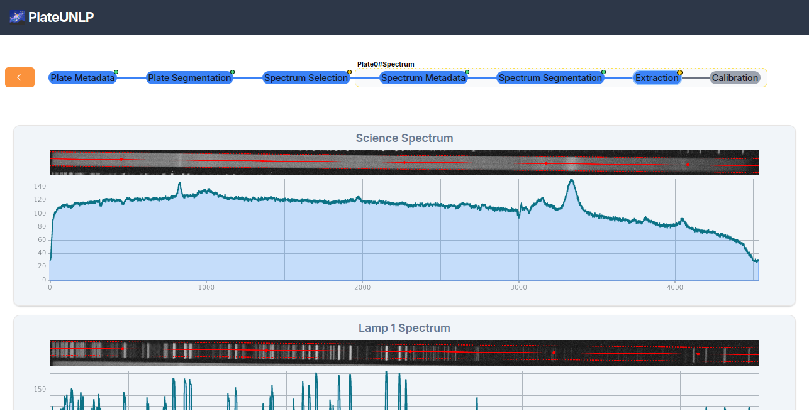
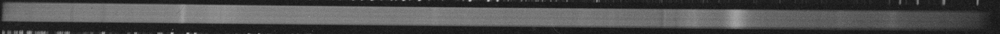
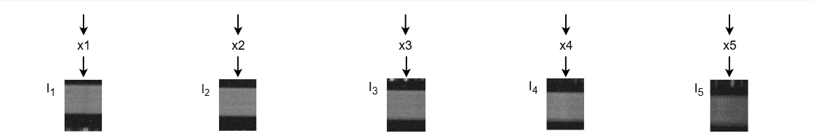
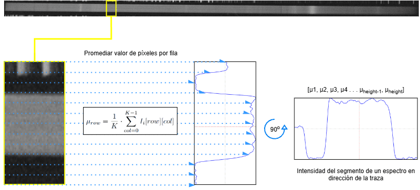
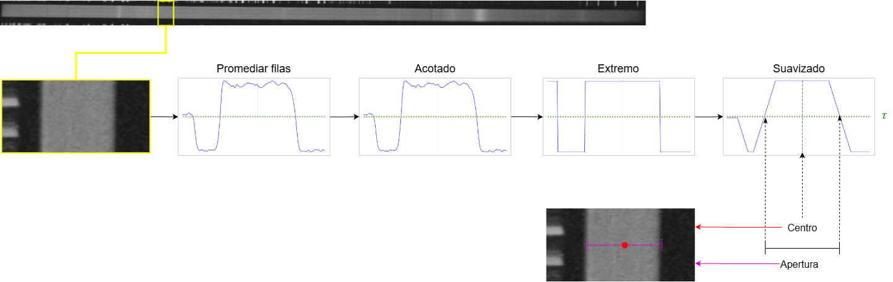
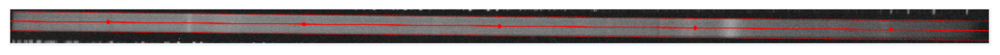
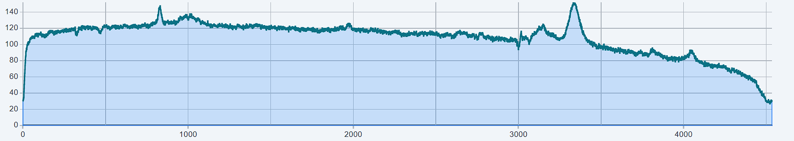
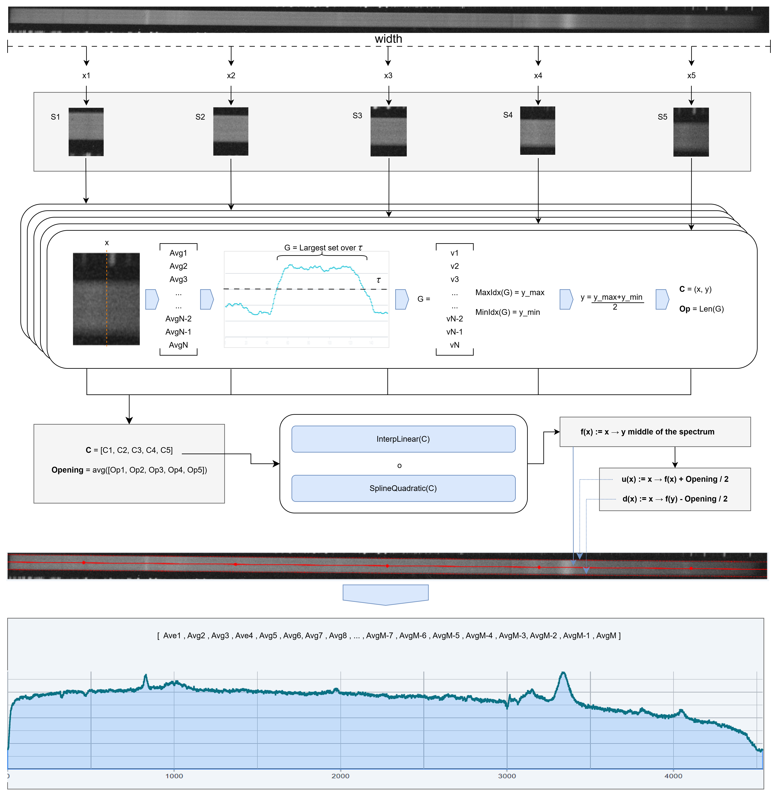
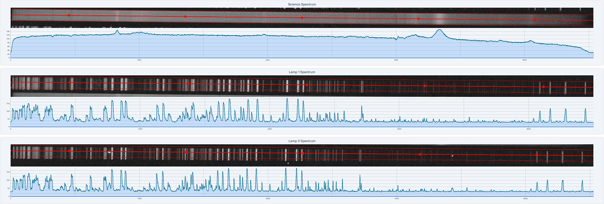
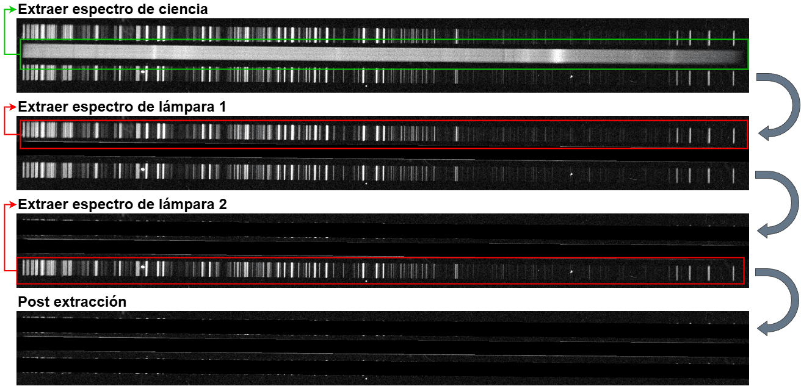

Esta etapa consiste en la obtención de los espectros 1D correspondientes a las imágenes del espectro de ciencia y los 2 espectros de lámparas aislados en [Segmentación de espectro](#segmentación-de-espectro).



## Espectro de ciencia

Para lograr la extracción de los espectros 1D lo primero es partir de la imagen $$\text{ImgSc}$$ del espectro de ciencia:



Se buscan $$N$$ valores equidistantes $$x_i$$ sobre el ancho ancho $$W$$ total de la imagen, por defecto $$N=5$$. Los $$x_i$$ se obtienen acorde a la fórmula:

```math
\begin{equation}
x_i = i \cdot \left( \frac{W}{N} \right) + \frac{1}{2} \cdot \left( \frac{W}{N} \right)
\end{equation}
```

Cada valor $$x_i$$ se lo ubica sobre el eje X de la matriz de la imagen y se copian en una nueva imagen las columnas que corresponden al intervalo de columnas $$[x_i - S_\text{width}/2: x_i + S_\text{width}/2]$$ respecto a la matriz de la imagen original. $$S_\text{width}$$ es el ancho **total** en pixeles de los segmentos a recortar, por defecto $$S_\text{width}=100$$. La subimagen correspondiente a cada $$x_i$$ la definimos como $$S_i$$

```math
\begin{equation}
S_i = \text{ImgSc}[...][ x_i - S_\text{width}/2 : x_i + S_\text{width}/2]
\end{equation}
```



Dada cada subimagen $$S_i$$, la cual corresponde a una matriz de píxeles de 2 dimensiones vamos a mapear sus valores a un arreglo donde cada posición se corresponde con una fila del segmento y los valores de todos los pixeles de una misma fila son promediados. Llamamos al arreglo resultante arreglo de promedios horizontales $$S_iAvgH$$,

```math
\begin{equation}
S_iAvgH = [AvgH_{1}, AvgH_{2}, ..., AvgH_{S_{height}}]
\end{equation}
```

Dada una fila $$row$$ el valor se su promedio horizontal se calcula como:

```math
\begin{equation}
S_iAvgH[row] = \frac{1}{S_{i(width)}} \cdot ∑_{col=0}^{S_{i(width)}-1} S_i[row][col]
\end{equation}
```



Antes de filtrar, cada arreglo $$S_iAvgH$$ se pesa con una función tipo super-gaussiana $$w(row)$$: vale $$≈1$$ en la zona central del recorte y cae bruscamente sólo cerca de los dos bordes (fila $$0$$ y fila $$S_{height}-1$$). El objetivo es que una fuga de intensidad de un espectro vecino —típicamente cerca de uno de los bordes del recorte— no domine la detección del centro. $$p$$ es el exponente que controla qué tan plano queda el techo (por defecto $$p=4$$) y $$W_{min}$$ el peso exacto en esos dos bordes, fila $$0$$ y fila $$S_{height}-1$$ (por defecto $$W_{min}=0.05$$; no puede ser $$0$$, porque colapsaría a cero casi todo el arreglo):

```math
\begin{equation}
c = \frac{S_{height}-1}{2}, \quad \hat{row} = \frac{row - c}{c}, \quad w(row) = W_{min}^{\ \hat{row}^{\,2p}}
\end{equation}
```

Definimos el arreglo pesado:

```math
\begin{equation}
S_iAvgH_w[row] = S_iAvgH[row] \cdot w(row)
\end{equation}
```

Este pesado sólo afecta la búsqueda del centro y la apertura que siguen a continuación; el promedio final del espectro 1D (más adelante, $$ArrCol_i$$) sigue usando los píxeles reales de la imagen, sin pesar. Se aplica igual para el espectro de ciencia y para las lámparas de comparación.

Sobre $$S_iAvgH_w$$ se aplica una serie de transformaciones y suavizados, para facilitar la distinción de por dónde pasa el espectro y por dónde sólo hay fondo. Cada paso se marca con un superíndice numerado ($$^{(1)}, ^{(2)}, ...$$) respecto al anterior. Primero se acotan los valores atípicos, al límite de $$±1.96·σ$$ (el valor que cubre $$≈95\%$$ de los datos en una distribución normal):

```math
\begin{equation}
S_iAvgH_w^{(1)}[row] =
\begin{cases}
L_{sup,i} & \text{si } S_iAvgH_w[row] > L_{sup,i} \\
S_iAvgH_w[row] & \text{si } L_{inf,i} \leq S_iAvgH_w[row] \leq L_{sup,i} \\
L_{inf,i} & \text{si } S_iAvgH_w[row] < L_{inf,i}
\end{cases}
\end{equation}
```

```math
\begin{equation}
L_{inf,i} = \mu_i - 1.96 \cdot \sigma_i, \qquad L_{sup,i} = \mu_i + 1.96 \cdot \sigma_i
\end{equation}
```

con $$\mu_i$$ y $$\sigma_i$$ la media y el desvío de $$S_iAvgH_w$$. Con los datos acotados se hace un normalizado min-max, para dejar los valores entre $$0$$ y $$1$$:

```math
\begin{equation}
S_iAvgH_w^{(2)}[row] = \frac{S_iAvgH_w^{(1)}[row] - \min(S_iAvgH_w^{(1)})}{\max(S_iAvgH_w^{(1)}) - \min(S_iAvgH_w^{(1)})}
\end{equation}
```

Como el punto medio de un arreglo normalizado siempre es $$0.5$$, se aprovecha ese límite como umbral $$τ=0.5$$ para empujar la señal a los extremos, lo que la hace más pronunciada:

```math
\begin{equation}
S_iAvgH_w^{(3)}[row] =
\begin{cases}
1 & \text{si } S_iAvgH_w^{(2)}[row] \geq τ \\
0 & \text{si } S_iAvgH_w^{(2)}[row] < τ
\end{cases}
\end{equation}
```

Por último se aplica un suavizado de media móvil, con una ventana proporcional al alto del recorte, para tratar irregularidades puntuales de la señal (si la mayor parte de una franja está en $$1$$ pero un tramo chico está en $$0$$, el suavizado la empuja de vuelta a $$1$$):

```math
\begin{equation}
window = S_{height} \cdot 0.15
\end{equation}
```

```math
\begin{equation}
S_iAvgH_w^{(4)}[row] = \frac{1}{window} \cdot \sum_{k=-\lfloor(window-1)/2\rfloor}^{\lfloor(window-1)/2\rfloor} S_iAvgH_w^{(3)}[row+k]
\end{equation}
```

Sobre el arreglo suavizado se identifican las secuencias contiguas de valores que quedan por encima del umbral $$τ=0.5$$, denominadas $$𝐺_{i,1}, 𝐺_{i,2}, ..., 𝐺_{i,k}$$. Se elige el grupo más largo, que se asume es el que mejor corresponde a la señal del espectro:

```math
\begin{equation}
G_i = \arg\max_{G_{i,j}} \, |G_{i,j}|
\end{equation}
```

Los valores contenidos en $$G_i$$ se corresponden con el rango de píxeles verticales donde se estima que se encuentra el espectro. Dado el índice superior $$y_{i, up}$$ y el inferior $$y_{i, down}$$, se calcula el píxel central del espectro en el segmento $$S_i$$ y la apertura de ese segmento:

```math
\begin{equation}
y_i = \frac{y_{i, up} + y_{i, down}}{2}, \qquad opening_i = |y_{i, up} - y_{i, down}|
\end{equation}
```



Ahora que conocemos que a cada píxel horizontal $$x_i$$ le corresponde una fila $$y_i$$. que representa el centro del espectro, se puede definir una serie de $$N$$ puntos que trazan el centro del espectro de ciencia como:

```math
\begin{equation}
c_{i} = (x_i, y_i)
\end{equation}
```

```math
\begin{equation}
C = \{(x_i, y_i)\}_{i=0}^{N-1}
\end{equation}
```

Promediando las aperturas $$opening_i$$ calculadas antes se obtiene el valor promedio de qué tan ancho es el espectro en todos los $$S_i$$:

```math
\begin{equation}
Opening = \frac{1}{N} \cdot ∑_{i=0}^{N-1} |opening_i|
\end{equation}
```

Con los centros separados, lo que sigue es trazar la función que recorre el centro del espectro de ciencia. Se contemplaron dos métodos para construir dicha función:

```math
\begin{equation}
f(x) = Interp_{linear}(C)
\end{equation}
```

o

```math
\begin{equation}
f(x) = Spline_{quadratic}(C)
\end{equation}
```

`extractSpectrum` soporta ambos métodos, pero hoy el llamador (`recalculateSpectrums1D`) siempre usa regresión lineal — la elección de método no está expuesta al usuario en la interfaz actual. Para tener más información respecto a cada opción consultar [Funciones de Interpolación](../interpolation-functions/index.md).

Una vez definida la función $$f(x)$$, que dado cualquier píxel horizontal $$x$$ indica la altura por la que pasa el centro del espectro, es posible obtener las funciones que delimitan el borde superior $$u(x)$$ e inferior $$d(x)$$ del espectro, utilizando el valor promedio de apertura $$Opening$$:

```math
\begin{equation}
u(x) := x → f(x) + Opening / 2
\end{equation}
```

```math
\begin{equation}
d(x) := x → f(x) - Opening / 2
\end{equation}
```

A continuación se muestran las trazas de estas 3 funciones sobre la imagen del espectro. En medio $$f(x)$$ como una línea roja continua, arriba y abajo, $$u(x)$$ y $$d(x)$$ respectivamente como líneas rojas punteadas:



Para cada valor de $$x$$, utilizando las funciones $$u(x)$$ y $$d(x)$$, podemos determinar el intervalo vertical que contiene el espectro en la columna correspondiente de la imagen. Así, definimos un subconjunto de píxeles por columna:

```math
\begin{equation}
ArrCol_i = \{ Img[i,j] \}_{j=u(i)}^{d(i)}
\end{equation}
```

Luego, calculamos el valor promedio de intensidad en cada una de estas columnas para obtener el espectro de ciencia unidimensional, $$ScienceSpectrum1D$$:

```math
\begin{equation}
M = |ArrCol_i|
\end{equation}
```

```math
\begin{equation}
\text{ScienceSpectrum1D} = \{ \frac{1}{M} \cdot ∑_{k=0}^{M} ArrCol_i[k] \}_{i=0}^{Img_{width}}
\end{equation}
```

Finalmente, se grafica el espectro resultante, representando la intensidad promedio del espectro de ciencia para cada píxel horizontal de la imagen:



El siguiente gráfico proporciona una visión general de todo el procedimiento necesario para obtener el espectro de ciencia unidimensional (1D):



## Lamparas de comparación

Para extraer las lámparas de comparación **no se ajusta una función nueva**: se reutiliza la misma función de traza $$f(x)$$ ya calculada para el espectro de ciencia y se la desplaza verticalmente (offset constante) hasta que coincida con los centros detectados en el recorte de la lámpara. La altura del recorte de la lámpara no se usa para nada en este cálculo.

Se repite el mismo procedimiento de la sección anterior (incluyendo el pesado de bordes) sobre la imagen de la lámpara, obteniendo su propio conjunto de centros $$C_{lamp} = \{(x_i, y_{i,lamp})\}_{i=0}^{N-1}$$ y su propia apertura promedio $$Opening_{lamp}$$ (calculada igual que $$Opening$$, sin relación con la del espectro de ciencia). Con la traza de ciencia $$f(x)$$ ya ajustada, se calcula cuánto habría que desplazarla en cada checkpoint para que pase por el centro detectado ahí:

```math
\begin{equation}
offset_i = f(x_i) - y_{i,lamp}
\end{equation}
```

y se toma la mediana de esos desplazamientos, no el de un único checkpoint, para que uno solo contaminado no arrastre la traza completa:

```math
\begin{equation}
offset = \mathrm{median}(\{offset_0, offset_1, ..., offset_{N-1}\})
\end{equation}
```

```math
\begin{equation}
f_{lamp}(x) = f(x) - offset
\end{equation}
```

Con esto podemos calcular $$u'(x)$$ y $$d'(x)$$, análogas a $$u(x)$$ y $$d(x)$$ pero para la lámpara:

```math
\begin{equation}
u'(x) = f_{lamp}(x) + Opening_{lamp} / 2
\end{equation}
```

```math
\begin{equation}
d'(x)= f_{lamp}(x) - Opening_{lamp} / 2
\end{equation}
```

Podemos definir los grupos de valores de pixeles que entran dentro rango definido por $$u'(x)$$ y $$d'(x)$$ para cada columna $$i$$ de la imagen:

```math
\begin{equation}
ArrCol_i = \{ Img[i,j] \}_{j=u'(i)}^{d'(i)}
\end{equation}
```

Luego, se calcula el valor promedio de intensidad en cada columna para obtener el espectro de Lampara unidimensional, $$LampSpectrum1D$$:

```math
\begin{equation}
M = |ArrCol_i|
\end{equation}
```

```math
\begin{equation}
\text{LampSpectrum1D} = \{ \frac{1}{M} \cdot ∑_{k=0}^{M} ArrCol_i[k] \}_{i=0}^{Img_{width}}
\end{equation}
```

Este procedimiento se repite para ambas lamparas de comparación, obteniendo asi las funciones descriptivas de cada una:



## Enmascarado

Muchas observaciones están inclinadas, lo que hace que el recorte usado para encuadrar cada espectro sea más alto de lo estrictamente necesario — y a mayor altura, más probable que la banda de un espectro invada la imagen de otro. Para que esa invasión no contamine la detección de los espectros que todavía faltan procesar, cada vez que se termina de extraer un espectro se enmascara su apertura ($$u(x)$$/$$d(x)$$, o $$u'(x)$$/$$d'(x)$$ para una lámpara) sobre la observación completa, rellenando esa franja con fondo antes de seguir con el próximo. El orden es siempre el mismo: primero el espectro de ciencia, después cada lámpara de comparación.

En el código esto lo resuelve `maskingObservation` (`app/routes/_app/observation.$observationId/-utils/mask-observation.ts`), reusando `spectrumMask` que devuelve `extractSpectrum` para cada espectro.

