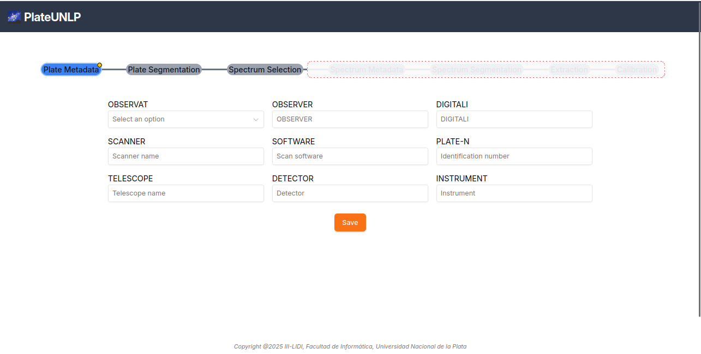

Lo primero que se encuentra al abrir el software es la sección de metadatos de Placa:

En esta sección se completan los metadatos comunes a todos los espectros contenidos en una misma placa. Estos son:

| Metadato               |                           Definición                            |
| :--------------------- | :-------------------------------------------------------------: |
| OBSERVAT (obligatorio) |           Observatorio donde se capturó la placa            |
| PLATE-N (obligatorio)  |                 Identificador de placa en catálogo                 |
| TELESCOPE              |             Telescopio con el que se realizó la toma              |
| INSTRUME               |      Instrumento usado en la observación (por ejemplo, un espectrógrafo)      |
| DETECTOR               |                 Detector que registró la observación                 |
| OBSERVER               |                  Persona que realizó la observación                  |
| OBSNOTES               |         Notas del observador sobre la calidad o condiciones         |
| NOTES                  |                Notas generales sobre la placa o el blanco                |
| SCANNER                |             Modelo o especificación del escáner empleado             |
| SCANRES                |                 Resolución del escaneo, expresada en dpi                 |
| SCANGAIN               |                Ganancia del escáner, en electrones por ADU                |
| SCANSOFT               |                Software utilizado para digitalizar la placa                |
| DATESCAN               |              Fecha y hora local en que se digitalizó la placa              |
| SCANAUTH               |                     Persona que realizó el escaneo                     |

`PIXSIZE` no se edita manualmente: se deriva automáticamente a partir de `SCANRES` para los encabezados FITS exportados.

Los cambios se guardan automáticamente a medida que el usuario edita el formulario.
