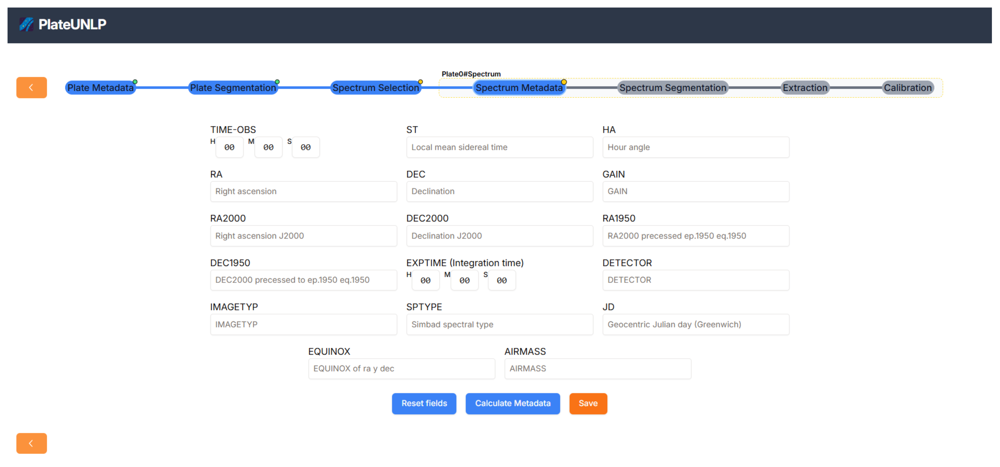

This section describes the observation metadata handled by PlateUNLP. Part of it is provided by the user and part of it can be computed automatically from the observation date, the observed object, and the observatory stored in the plate metadata.

PlateUNLP needs these values to compute the derived metadata:
|    Name    | Description                                 |
| :--------: | :------------------------------------------ |
|  `OBJECT`  | Name of the observed object                 |
| `DATE-OBS` | Observation datetime in Universal Time      |

Also, it will infer the `OBSERVAT` (observatory) from [plate metadata](../plate-metadata/index.md). From the `OBSERVAT` we can get the latitude, longitude, elevation and timezone of the observatory.

From those, PlateUNLP is able to compute the following metadata, ordered by the time they are calculated:

|    Name    | Description                                      | Source                                                                  | Depends on                              |
| :--------: | :----------------------------------------------- | :---------------------------------------------------------------------- | :-------------------------------------- |
|    `JD`    | Julian date in UT                                | [`getJulianDate`](../reference/astronomical/index.md#getjuliandate)     | `DATE-OBS`                              |
|  `EPOCH`   | Epoch of `RA` and `DEC`                          | —                                                                       | `JD`                                    |
| `EQUINOX`  | Equinox of `RA` and `DEC`                        | —                                                                       | `JD`                                    |
| `MAIN-ID`  | Main identifier in SIMBAD                        | SIMBAD                                                                  | `OBJECT`                                |
|  `SPTYPE`  | Spectral type in SIMBAD                          | SIMBAD                                                                  | `OBJECT`                                |
|    `RA`    | Right ascension (FK4)                            | SIMBAD                                                                  | `OBJECT`, `EPOCH`, `EQUINOX`            |
|   `DEC`    | Declination (FK4)                                | SIMBAD                                                                  | `OBJECT`, `EPOCH`, `EQUINOX`            |
|  `RA2000`  | Right ascension (ICRS)                           | SIMBAD                                                                  | `OBJECT`                                |
| `DEC2000`  | Declination (ICRS)                               | SIMBAD                                                                  | `OBJECT`                                |
|  `RA1950`  | Right ascension (FK4, J1950.0)                   | SIMBAD                                                                  | `OBJECT`                                |
| `DEC1950`  | Declination (FK4, J1950.0)                       | SIMBAD                                                                  | `OBJECT`                                |
| `DATE-ORG` | Local mean datetime of the observation           | [`getLocalDateTime`](../reference/astronomical/index.md#getlocaltime)   | `DATE-OBS`, `OBSERVAT` (timezone)       |
|    `ST`    | Local mean sidereal time                         | [`getSiderealTime`](../reference/astronomical/index.md#getsiderealtime) | `JD`, `OBSERVAT` (longitude)            |
|    `HA`    | Local hour angle                                 | [`getHourAngle`](../reference/astronomical/index.md#gethourangle)       | `ST`, `RA2000`                          |
| `AIRMASS`  | Airmass of the object at the time of observation | [`getAirmass`](../reference/astronomical/index.md#getairmass)           | `HA`, `DEC2000`, `OBSERVAT` (latitude)  |

The user can also complete additional observation metadata directly in the form:

|    Name    | Description |
| :--------: | :---------- |
| `EXPTIME`  | Exposure time in seconds |
| `IMAGETYP` | Observation type, for example `object`, `dark`, `zero`, `flat` or `arc` |

Only `OBJECT`, `DATE-OBS` and the observatory inherited from the plate are required to compute most of the derived values.

SPTYPE y MAIN-ID no son obtenibles de forma puramente analítica por lo que es necesario consultarlo al repositorio externo [SIMBAD](https://simbad.cfa.harvard.edu/simbad/).

Además, el usuario puede indicar que no conoce algunos de los 4 metadatos esenciales. Dependiendo de la información disponible el sistema calculara mas o menos información. El siguiente diagrama muestra que metadatos se requieren para obtener cada uno  y si estos requieren la interacción del usuario o una consulta a un repositorio externo:

Una vez calculados todos los datos, el usuario puede modificar los valores determinados por PlateUNLP si considera que no son correctos.

Los cambios se guardan automáticamente a medida que el usuario edita el formulario.
