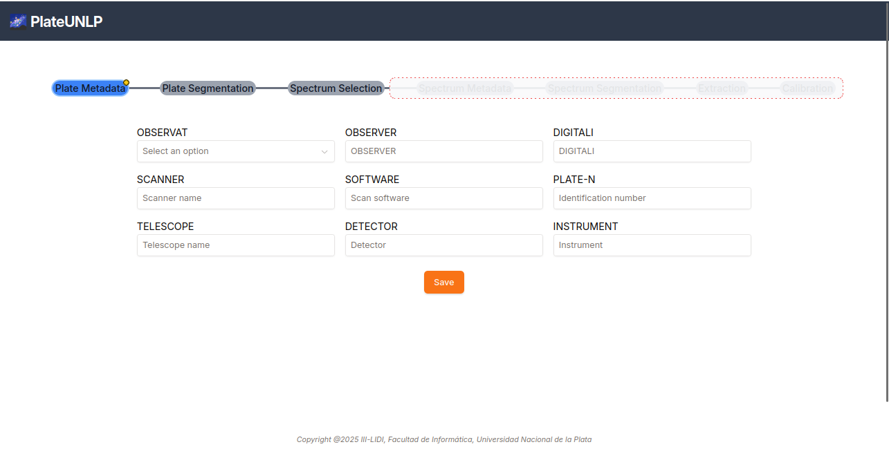

# Metadatos de Placa

Lo primero que se encuentra al abrir el software es la sección de metadatos de Placa:

En esta sección se completan los metadatos comunes a todos los espectros contenidos en una misma placa. Estos son:

| Metadato | Definición |
|:---------|:----------:|
| OBSERVAT (obligatorio) | Observatorio donde se capturó la placa |
| PLATE-N (obligatorio) | Identificador de placa |
| OBSERVER | Persona que realizó las observaciones |
| DIGITALI | Persona que digitalizo las observaciones |
| SCANNER | Especificación técnica del escáner empleado |
| SOFTWARE | Software usado para digitalizar la placa |
| TELESCOPE | Telescopio con el que se capturaron los datos |
| DETECTOR | Instrumento que se capturó la imagen |
| INSTRUMENT | El instrumento que se utilizó (ej: espectrógrafo) |

Una vez especificados todos los metadatos (como mínimo, los obligatorios), el usuario puede avanzar a la siguiente etapa haciendo clic en el botón _Save_.

**NOTA**: Si faltan metadatos obligatorios, se señalarán los campos faltantes al hacer clic en _Save_.
