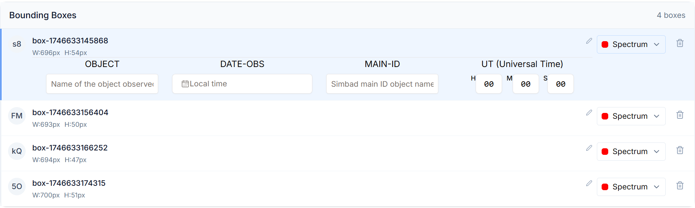

# Segmentación de placa (Identificación de espectros)

La etapa de Segmentacion de placa busca identificar las porciones del escaneo original que se corresponden a cada espectro a procesar.

Lo primero que hay que hacer es cargar el archivo de la placa escaneada:

Cargado el archivo se habilita la interfaz de segmentacion de espectros, compuesta por los siguientes elementos:

1. **Boton _Autodetect Bounding Boxes_**: al cliquearlo se ejecuta un modelo detector de espectros sobre la imagen. Sus predicciones se aprovechan para identificar las posiciones de cada espectro y señalarlas con cajas delimitadoras.

Para saber mas leer [Detector de Espectros](./DetectorDeEspectros.md)

2. **_Rotate 90º_**: al cliquear, la imagen es rotada la imagen 90º a la derecha. Solo visualización (no afecta como se almacenan los datos mas adelante)9.

3. **_Invert colors_**: invierte los colores de la imagen. Solo visualización.

4. **_Draw Box_**: al seleccionarlo se entra en modo de dibujo, que permite al usuario crear cajas delimitadoras sobre la imagen. Asi este puede indicar la posicion de espectros de forma manual.

5. **_Area de vizualización_**: se muestra el escaneo seleccionado en un menu interactivo que permite acercar/alejar/arrastrar la imagen. Tambien muestra las cajas delimitadoras especificadas y permite su redimension/arrastre. Para interactuar con una caja delimitadora hay que hacer click sobre ella y entrara en modo de edicion, para deseleccionarla basta con volver a cliquear la caja seleccionada o seleccionar otra caja.

6. **_Bounding Boxes List_**: Aqui se muestran un listado de cada una de las cajas delimitadoras especificadas sobre la imagen:

De cada caja se muestra su identificador (izquierda), el tipo de objeto que hay dentro (derecha), un boton para eliminar la caja (derecha). Cuando una caja delimitadora esta seleccionada tambien se muestra un conjunto de inputs con informacion que se tiene que especificar sobre cada caja:
    - OBJECT: Nombre del objeto observado.
    - DATE-OBS: Fecha de observación.
    - MAIN-ID: ID principal en la base de datos astronomica Simbad.
    -UT: tiempo universal.

    Se usaran mas adelante para obtener el valor de un listado mas grande de metadatos.

Una vez especificada la ubicacion de todos los espectros y sus valores especificados se habilita el boton _Save_ con el que se podra pasar a la siguiente etapa.
