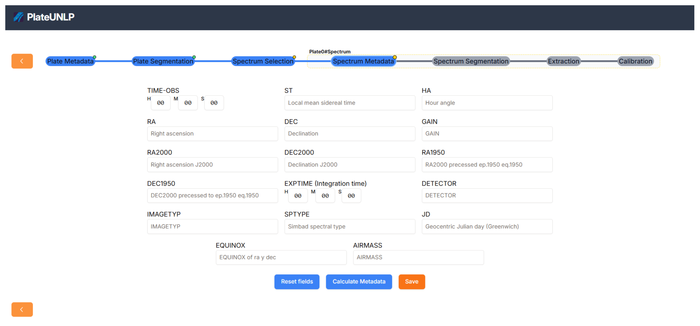
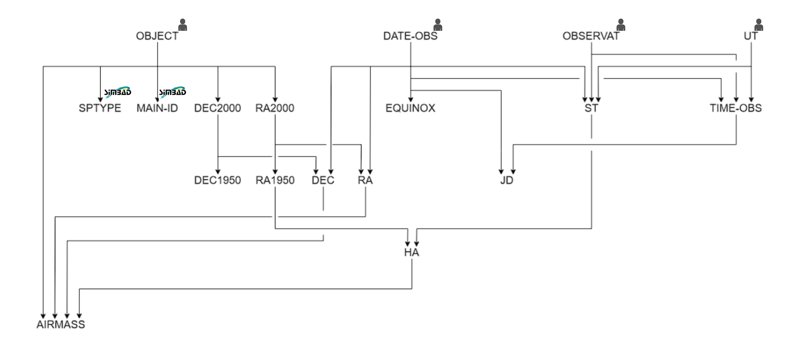

# Metadatos de espectro

En esta sección se busca obtener los metadatos que corresponden específicamente al espectro con el que se está trabajando:

PlateUNLP aprovecha los datos ingresados hasta el momento por el usuario para calcular automáticamente los valores de los siguientes metadatos:

| Metadato | Definición |
|:---------|:----------:|
| TIME-OBS | Tiempo local al inicio de la observación |
| ST | Tiempo sideral medio local|
| HA | Ángulo horario |
| RA | Ascensión recta |
| DEC | Declinación |
| GAIN | Ganancia, electrones por adu |
| RA2000 | Ascensión recta ICRS J2000 |
| DEC2000 | Declinación ICRS J2000 |
| RA1950 | Sistema de coordenadas FK4 |
| DEC1950 | Sistema de coordenadas FK4 |
| EXPTIME | Tiempo de integración en segundos |
| DETECTOR | Instrumento que captura la imagen |
| IMGTYP | Object, dark, zero, etc. |
| SPTYPE | Tipo espectral SIMBAD |
| JD | Fecha Juliana |
| EQUINOX | Época de RA y DEC |
| AIRMASS | Masa de aire |

Solo se requieren cuatro metadatos esenciales para calcular la mayor parte de la información: OBJECT, DATE-OBS, OBSERVAT y UT. Estos ya deberían haber sido especificados previamente, por lo que al ingresar a esta etapa, PlateUNLP calcula automáticamente el resto de los valores.

SPTYPE y MAIN-ID no son obtenibles de forma puramente analítica por lo que es necesario consultarlo al repositorio externo [SIMBAD](https://simbad.cfa.harvard.edu/simbad/).

Además, el usuario puede indicar que no conoce algunos de los 4 metadatos esenciales. Dependiendo de la información disponible el sistema calculara mas o menos información. El siguiente diagrama muestra que metadatos se requieren para obtener cada uno  y si estos requieren la interacción del usuario o una consulta a un repositorio externo:

Una vez calculados todos los datos, el usuario puede modificar los valores determinados por PlateUNLP si considera que no son correctos.

Al presionar el botón _Save_ se guardan los valores actuales y se pasa a la siguiente etapa.