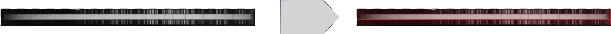

# Segmentación de espectro

Para segmentar un espectro en sus distintas partes se emplea una interfaz visual similar a la vista en [Segmentación de Placa](#segmentación-de-placa-identificación-de-espectros) pero con algunas diferencias:

1. **Boton _Autodetect Bounding Boxes_**: al cliquearlo se ejecuta un modelo detector de partes de espectros sobre la imagen. Sus predicciones se aprovechan para identificar las posiciones de las 2 espectros de lampara y el espectro de ciencia que hay en la imagen.

Para saber mas leer [Detector de Partes de Espectros](./DetectorDePartesDeEspectros.md)

2. **_Draw Box_**: al seleccionarlo se entra en modo de dibujo, que permite al usuario crear cajas delimitadoras sobre la imagen. Asi este puede indicar la posicion de espectros de forma manual.

3. **_Area de vizualización_**: se muestra el escaneo seleccionado en un menu interactivo que permite acercar/alejar/arrastrar la imagen. Tambien muestra las cajas delimitadoras especificadas y permite su redimension/arrastre. Para interactuar con una caja delimitadora hay que hacer click sobre ella y entrara en modo de edicion, para deseleccionarla basta con volver a cliquear la caja seleccionada o seleccionar otra caja.

4. **_Bounding Boxes List_**: Aqui se muestran un listado de cada una de las cajas delimitadoras especificadas sobre la imagen:

De cada caja se muestra su identificador (izquierda), el tipo de objeto que hay dentro (derecha) y un boton para eliminar la caja (derecha).

Una vez especificada la ubicacion de las 2 lamparas de comparación y del espectro de ciencia se habilita el boton _Save_ con el que se podra pasar a la etapa de extracción de caracteristicas.
