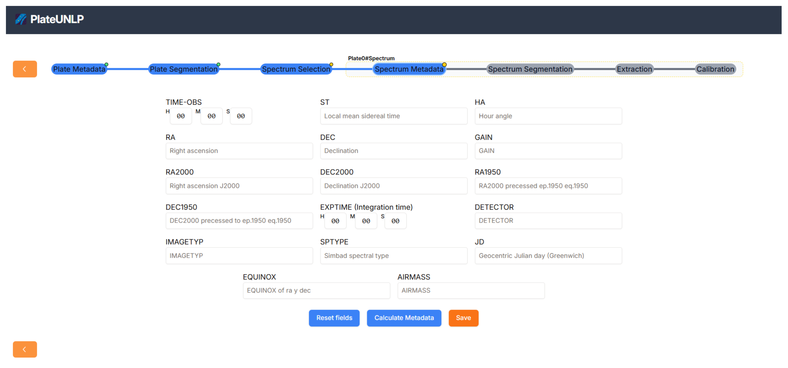

# Spectrum metadata

This section describe the metadata that PlateUNLP can calculate automatically for a spectrum. The metadata are calculated based on the information provided by the user in the previous steps, such as the date of observation, the object observed, and the observer's location.

PlateUNLP will need the user to fill these fields before proceeding to the next step:
|    Name    | Description                                 |
| :--------: | :------------------------------------------ |
|  `OBJECT`  | Name of the observed object                 |
| `DATE-OBS` | Date of the observation (in Universal Time) |
|    `UT`    | Time of the observation (in Universal Time) |

Also, it will infer the `OBSERVAT` (observatory) from [plate metadata](../plate-metadata/index.md). From the `OBSERVAT` we can get the latitude, longitude, elevation and timezone of the observatory.

From those, PlateUNLP is able to compute the following metadata, ordered by the time they are calculated:

|    Name    | Description                                      | Source                                                                  | Depends on                              |
| :--------: | :----------------------------------------------- | :---------------------------------------------------------------------- | :-------------------------------------- |
|    `JD`    | Julian date in UT                                | [`getJulianDate`](../reference/astronomical/index.md#getjuliandate)     | `DATE-OBS`, `UT`                        |
|  `EPOCH`   | Epoch of `RA` and `DEC`                          | —                                                                       | `JD`                                    |
| `EQUINOX`  | Equinox of `RA` and `DEC`                        | —                                                                       | `JD`                                    |
| `MAIN-ID`  | Main identifier in SIMBAD                        | SIMBAD                                                                  | `OBJECT`                                |
|  `SPTYPE`  | Spectral type in SIMBAD                          | SIMBAD                                                                  | `OBJECT`                                |
|    `RA`    | Right ascension of the telescope (FK4)           | SIMBAD                                                                  | `OBJECT` , `EPOCH`, `EQUINOX`           |
|   `DEC`    | Declination of the telescope (FK4)               | SIMBAD                                                                  | `OBJECT` , `EPOCH`, `EQUINOX`           |
|  `RA2000`  | Right ascension (ICRS)                           | SIMBAD                                                                  | `OBJECT`                                |
| `DEC2000`  | Declination (ICRS)                               | SIMBAD                                                                  | `OBJECT`                                |
|  `RA1950`  | Right ascension (FK4, J1950.0)                   | SIMBAD                                                                  | `OBJECT`                                |
| `DEC1950`  | Declination (FK4, J1950.0)                       | SIMBAD                                                                  | `OBJECT`                                |
| `TIME-OBS` | Local time at the start of the observation       | [`getLocalTime`](../reference/astronomical/index.md#getlocaltime)       | `DATE-OBS`, `UT`, `OBSERVAT` (timezone) |
|    `ST`    | Local mean sidereal time                         | [`getSiderealTime`](../reference/astronomical/index.md#getsiderealtime) | `JD`, `OBSERVAT` (longitude)            |
|    `HA`    | Local hour angle                                 | [`getHourAngle`](../reference/astronomical/index.md#gethourangle)       | `ST`, `RA2000`                          |
| `AIRMASS`  | Airmass of the object at the time of observation | [`getAirmass`](../reference/astronomical/index.md#getairmass)           | `HA`, `DEC2000`, `OBSERVAT` (latitude)  |

> [!NOTE]
> Lo siguiente es viejo, revisar.

| Metadato |            Definición             |
| :------- | :-------------------------------: |
| GAIN     |   Ganancia, electrones por adu    |
| EXPTIME  | Tiempo de integración en segundos |
| DETECTOR | Instrumento que captura la imagen |
| IMGTYP   |     Object, dark, zero, etc.      |
| SPTYPE   |       Tipo espectral SIMBAD       |

Solo se requieren cuatro metadatos esenciales para calcular la mayor parte de la información: OBJECT, DATE-OBS, OBSERVAT y UT. Estos ya deberían haber sido especificados previamente, por lo que al ingresar a esta etapa, PlateUNLP calcula automáticamente el resto de los valores.

SPTYPE y MAIN-ID no son obtenibles de forma puramente analítica por lo que es necesario consultarlo al repositorio externo [SIMBAD](https://simbad.cfa.harvard.edu/simbad/).

Además, el usuario puede indicar que no conoce algunos de los 4 metadatos esenciales. Dependiendo de la información disponible el sistema calculara mas o menos información. El siguiente diagrama muestra que metadatos se requieren para obtener cada uno  y si estos requieren la interacción del usuario o una consulta a un repositorio externo:

Una vez calculados todos los datos, el usuario puede modificar los valores determinados por PlateUNLP si considera que no son correctos.

Al presionar el botón _Save_ se guardan los valores actuales y se pasa a la siguiente etapa.