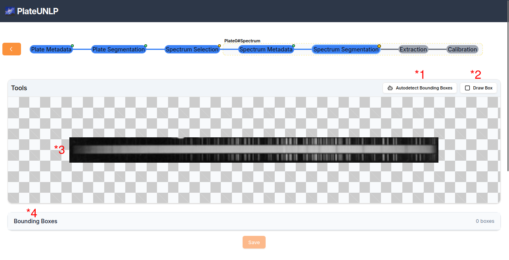
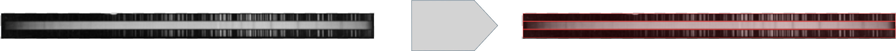
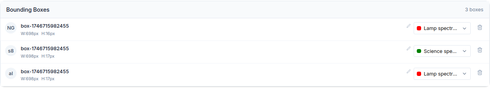

# Segmentación de espectro

Para segmentar un espectro en sus distintas partes se emplea una interfaz visual similar a la vista en [Segmentación de Placa](#segmentación-de-placa-identificación-de-espectros) pero con algunas diferencias:

1. **Boton _Autodetect Bounding Boxes_**: al hacer clic se ejecuta un modelo detector de partes de espectros sobre la imagen. Sus predicciones se utilizan para identificar las posiciones de los dos espectros de lámpara y del espectro de ciencia presentes en la imagen.

Para saber más leer [Detector de Partes de Espectros](../spectrum-part-detector/index.md)

1. **_Draw Box_**: al seleccionarlo, se entra en modo de dibujo, que permite al usuario crear cajas delimitadoras sobre la imagen. Así, puede indicar manualmente la posición de los espectros.

2. **_Area de vizualización_**: se muestra el escaneo seleccionado en un menú interactivo que permite acercar, alejar y arrastrar la imagen. También se visualizan las cajas delimitadoras creadas y es posible redimensionarlas o moverlas. Para interactuar con una caja, se debe hacer clic sobre ella para entrar en modo de edición. Para deseleccionarla, basta con volver a hacer clic sobre la misma caja o seleccionar otra.

3. **_Bounding Boxes List_**: aquí se muestra un listado de todas las cajas delimitadoras definidas sobre la imagen:

De cada caja se indica su identificador (izquierda), el tipo de objeto que contiene (centro-derecha) y un botón para eliminarla (derecha).

Una vez especificada la ubicación de las 2 lámparas de comparación y del espectro de ciencia se habilita el botón _Save_ con el que se podrá pasar a la etapa de extracción de características.
