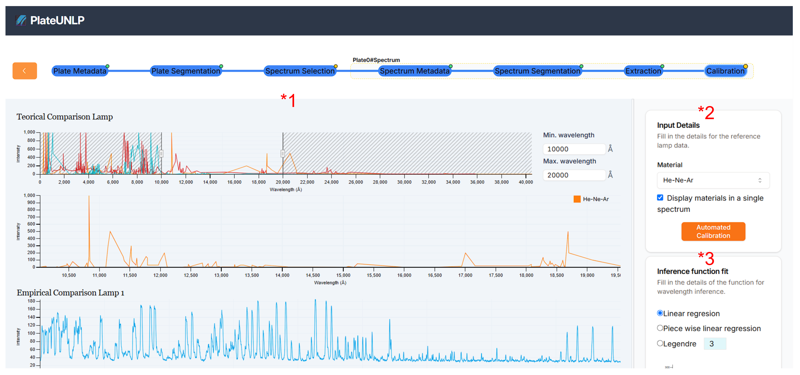
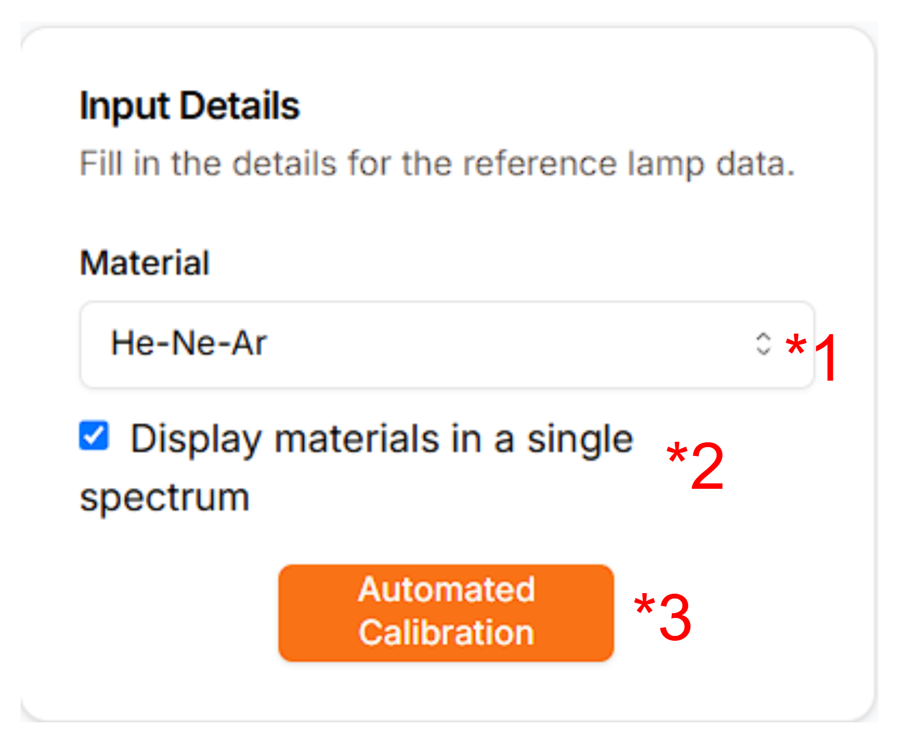
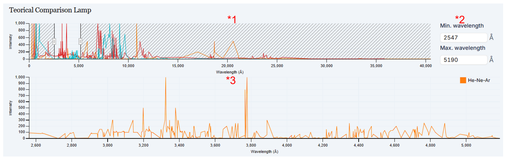
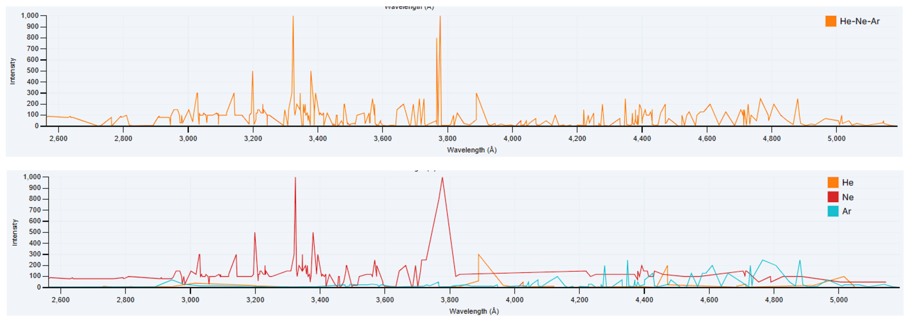
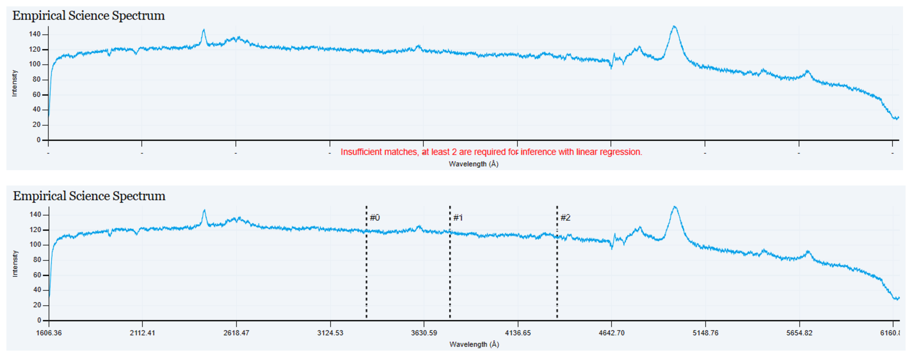
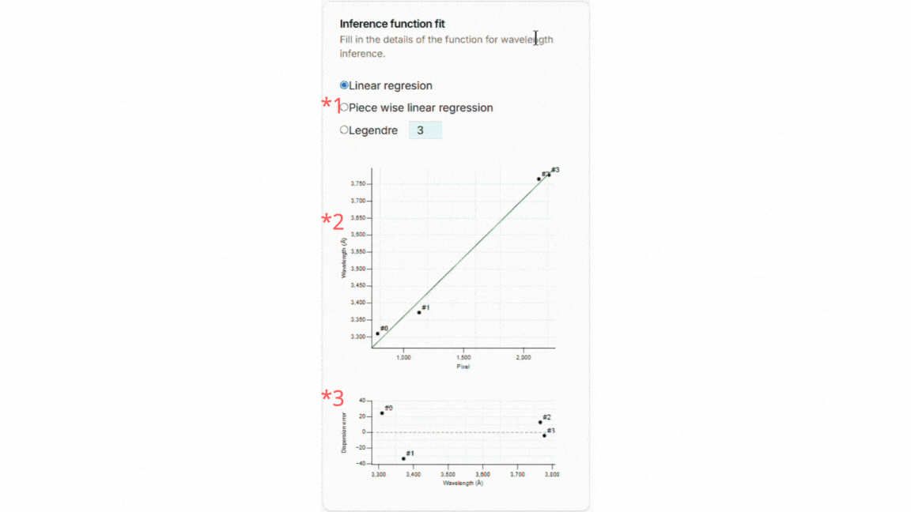

# Calibración en Longitud de Onda

La última etapa es averiguar qué longitudes de onda le corresponden a cada espectro unidimensional. Para ello se facilita el menú de calibración en longitud de onda:

Notar que tiene 2 regiones principales:

1. _Spectrums_: La región de la izquierda permite ver las funciones de los 3 espectros extraídos y el espectro de lámpara teórica que se emplea para calibrar.

2. _Input Details_: La región de la derecha arriba permite configurar el material del espectro de lámpara de teórica y como se muestra.

3. _Inference Function Fit_: La región de la derecha abajo permite elegir qué algoritmo se emplea para inferir las longitudes de onda intermedias entre los puntos calibrados y sus niveles de error.

## Elección de material de lámpara

Es necesario elegir con respecto a qué material se va a realizar la calibración en longitud de onda. Uno puede elegir el material en _Input Details_:

_PlateUNLP_ permite que el usuario elija de forma manual la configuración de materiales de la lámpara a través del menú de selección (*1) o puede permitir que _PlateUNLP_ busque cual es la configuración de materiales que combina mejor con el espectro dado (*3).

En todo caso el usuario también puede elegir si en la [visualización de la lámpara teórica](#lámpara-de-comparación-teórica) los espectros de cada material se mostrarán todos juntos o por separado.

## Sección de visualización

Como se dijo antes la región de la derecha sirve para visualizar los espectros involucrados en el proceso de calibración. Podemos ver los espectros de:
- [Lámpara de Comparación Teórica](#lámpara-de-comparación-teórica)
- [Lámpara de Comparación Empírica 1](#lámpara-de-comparación-empírica-1)
- [Lámpara de Comparación Empírica 2](#lámpara-de-comparación-empírica-2)
- [Espectro de Ciencia Empírico](#espectro-de-ciencia-empírico)

### Lámpara de Comparación Teórica

La lámpara de comparación teórica muestra 3 elementos principales:

1. Selector de rango: muestra una miniatura de la totalidad de longitudes de onda registradas para la lámpara especificada en [Elección de material de lámpara](#elección-de-material-de-lámpara).
Tiene 2 desplazadores que pueden arrastrarse izquierda y/o derecha para decidir la longitud de onda mínima y máxima que se mostrará en la visualización más grande de abajo.
2. Inputs numéricos: permiten especificar las longitudes de onda exactas a usar como mínimo y máximo.
3. Visualización específica: Muestra la lámpara de comparación en el rango especificado. Su apariencia varía dependiendo si en [Elección de material de lámpara](#elección-de-material-de-lámpara) el usuario opta por mostrar los espectros de cada material combinados o separados:

### Lámpara de Comparación Empírica 1

Lámpara de comparación empírica 1, que se extrajo en [Extracción de Características](./feature-extraction.md). El eje X muestra o no las longitudes de onda dependiendo de si ya hay suficientes datos para realizar la calibración.

### Lámpara de Comparación Empírica 2

Lámpara de comprobación empírica 2, que se extrajo en [Extracción de Características](./feature-extraction.md). El eje X muestra o no las longitudes de onda dependiendo de si ya hay suficientes datos para realizar la calibración.

### Espectro de Ciencia Empírico

Espectro de ciencia empírico, que se extrajo en [Extracción de Características](./feature-extraction.md). El eje X muestra o no las longitudes de onda dependiendo de si ya hay suficientes datos para realizar la calibración.

## Realizando la calibración

Para realizar la calibración se pide al usuario que seleccione puntos coincidentes entre la lámpara teórica y las de referencia hasta que se tengan suficientes coincidencias para realizar la inferencia de las demás longitudes de onda:

Para ubicar una coincidencia basta con ir cliqueando de forma secuencial los puntos que coinciden, _PlateUNLP_ mostrara las coincidencias con líneas punteadas y un identificador numérico.

Para borrar una marca basta con volver a hacer click en la marca mostrada.

## Elegir Función de Ajuste

Para elegir qué función se va a usar para inferir las longitudes de onda intermedias se emplea el menú de inferencia de función de ajuste:

Hay 3 componentes principales:
1. Selector de función de ajuste: el usuario puede elegir entre 3 métodos para aproximar una función que permita realizar un mapeo de cada píxel vertical de la imagen a una longitud de onda determinada. Se puede optar por _regresion lineal_, _spline lineal_ y _legendre_. En la opción de _legendre_ permite especificar el grado del polinomio a ajustar. Para más información sobre los métodos de obtención de la función de ajuste consultar [Métodos de obtención de función de ajuste](./fit-function-methods.md).

2. Gráfico de correspondencia (pixel, longitud de onda): los puntos negros representan las coincidencias ubicadas por el usuario. Como línea verde, la función de ajuste entrenada.

3. Gráfico de error (longitud de onda, error de dispersión): el gráfico indica para cada longitud especificada por el usuario el error que tiene respecto a lo que indica la función de ajuste.