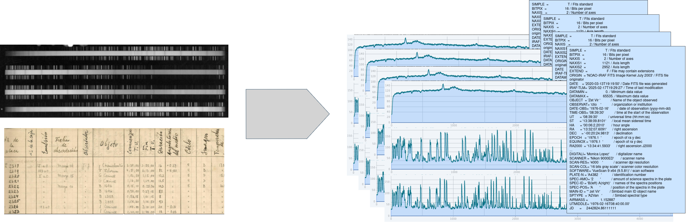
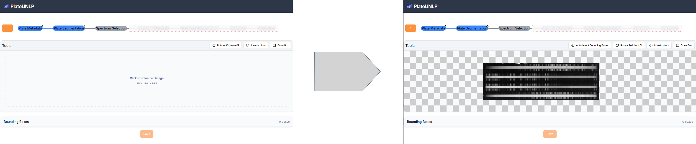
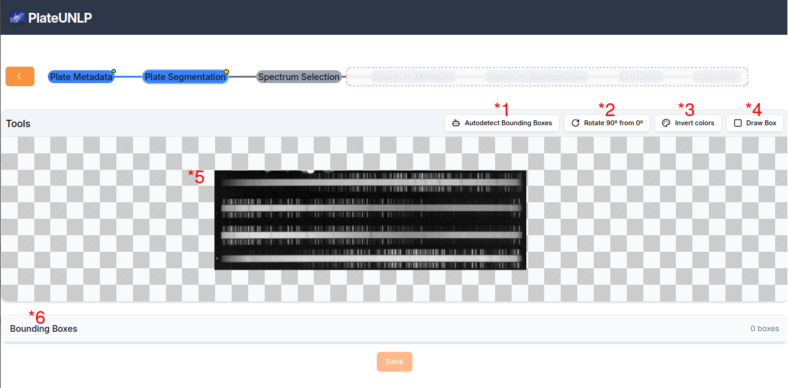

# Introducción

PlateUNLP es un software diseñado para procesar la informacion de imagenes de espectros de luz (usualmente ruidosas) para conseguir la información importante extraida y limpia.

De cada placa se separa la informacion relacionada a cada espectro que contiene, recopilando funciones de cada espectro, calibradas en la longitud de onda que les corresponda asi como los metadatos mas relevantes que le corresponden (Main-Id, UT, ...).

# Distribución de componentes

El software esta compuesto por 2 componentes principales:

1. Barra de navegación: muestra la etapa de procesamiento actual y permite la navegacion entre distintas etapas.
2. Seccion funcional: Aqui se localizan menus o interfaces necesarios para resolver cada. Naturalmente, el contenido varia de etapa a etapa.

# Metadatos de Placa

Lo primero que uno se encuentra al abrir el software es la seccion de metadatos de Placa:

En esta seccion se busca obtener los metadatos que son comunes a todos espectros que hay en una misma placa, sean estos:

- OBSERVAT (obligatorio): Observatorio donde se capturo la placa
- PLATE-N (obligatorio): identificador de placa.
- OBSERVER: Persona que realizo las observaciones
- DIGITALI: Persona que digitalizo las observaciones.
- SCANNER: Especificacion tecnica de escaner usado para digitalizar la placa.
- SOFTWARE: Software usado para digitalizar la placa.
- TELESCOPE: Telescopio con el que se capturaron los datos.
- DETECTOR: ...
- INSTRUMENT: ...

Una ves especificados todos los metadatos (minimo los obligatorios) el usuario puede acceder a la siguiente etapa por medio del boton _Save_.

**NOTA**: Si faltan metadatos obligatorios se le señalara al usuario marcando los campos faltantes al cliquiear _Save_.

# Segmentacón de placa (Identificación de espectros)

La etapa de Segmentacion de placa busca identificar las porciones del escaneo original que se corresponden a cada espectro a procesar.

Lo primero que hay que hacer es cargar el archivo de la placa escaneada:

Cargado el archivo se habilita la interfaz de segmentacion de espectros, compuesta por los siguientes elementos:

1.
